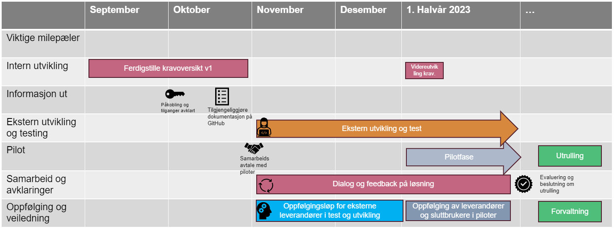

# Om tjenesten

Kravoversikten er en tjeneste vi tilbyr til regnskapssystemer og banker hvor vi via APIer tilgjengeliggjør alle krav Skatteetaten har til den næringsdrivende. Formålet er at regnskapssystemer og banker kan utvikle og tilgjengeliggjøre en oversikt i sine flater som vil gi den næringsdrivende en bedre oversikt over sine nåværende og fremtidige krav og dermed enklere kan håndtere og følge opp disse.

Målgruppen er i første omgang enkeltpersonsforetak og små og mellomstore AS med og uten regnskapsfører.

Første versjon av kravoversikten vil inneholde alle krav, alle åpne krav, alle innbetalinger og uplasserte innbetalinger. I tillegg vil det følge betalingsinformasjon så den næringsdrivende kan betale sine krav løpende.

I neste versjon vil vi utvide med informasjon om utbetaling, samt merking av krav som er utsatt og andre mindre endringer.

## Tidsplan

**Oktober 2022**: Løpende publisering av dokumentasjon for første versjon av kravoversikten

**November 2022**: Våre systemer åpner for at eksterne leverandører skal kunne starte utvikling og test på første versjon av kravoversikten

**Januar 2023**: Skatteetaten åpner for pilotering av første versjon av kravoversikten i samarbeid med enkelte leverandører. Etter endt pilotperiode vil det bli besluttet videre løp for utrulling til flere leverandører og banker.

**Våren 2023**: Planlagte utvidelser av kravoversikten.



## Oppfølging og støtte

I testfasen vil vi tilby støtte til de eksterne leverandørene gjennom utvikling og test.

I pilotfasen vil vi tilby informasjon og eventuell opplæring til leverandørenes kundesenter for å hjelpe dem å håndtere og rute videre henvendelser til riktig kanal inn mot Skatteetaten.

Mer informasjon kommer her. I mellomtiden ta kontakt med:

- Testleder [KristinaLassen.Tangen@skatteetaten.no](mailto:KristinaLassen.Tangen@skatteetaten.no) for spørsmål knyttet til test
- Utviklingsleder [Andreas.Kongshaug@skatteetaten.no](mailto:Andreas.Kongshaug@skatteetaten.no) for spørsmål knyttet til utvikling
- Endringsleder [Anneosterbo.Mevatne@skatteetaten.no](mailto:Andreas.Kongshaug@skatteetaten.no) for andre spørsmål

## Teknisk
### Endepunkter
#### Utbetalinger
Denne tjenesten er ennå ikke tilgjengelig for bruk.

Gjør oppslag mot reskontrosystemene på alle utbetalinger innen et gitt tidsrom på maks ett år.

##### Format på respons

```json
  {
  "forespurtPart": "string",
  "periode": {
    "start": "2022-10-05T07:02:19.064Z",
    "slutt": "2022-10-05T07:02:19.064Z"
  },
  "utbetaling": [
    {
      "part": "string",
      "utbetalingsbeskrivelse": "string",
      "utbetaltdato": "2022-10-05T07:02:19.064Z",
      "utbetaltBeloep": 0,
      "betaltTil": {
        "kidnummer": "string",
        "konto": {
          "bankinformasjon": "string",
          "kontoeiersNavn": "string",
          "kontonummer": "string",
          "iban": "string",
          "swiftBIC": "string"
        }
      },
      "utbetalingIdentifikator": "string",
      "grunnlagForUtbetaling": [
        {
          "dekketKrav": "string",
          "kravIdentifikator": "string",
          "kravtype": "string",
          "kravperiode": {
            "start": "2022-10-05T07:02:19.064Z",
            "slutt": "2022-10-05T07:02:19.064Z"
          },
          "opprinneligBeloep": 0,
          "gjenstaaendeBeloep": 0
        }
      ]
    }
  ]
}
```

#### Oversikt
Hent oversikt over åpne krav og uplasserte innbetalinger.

Gjør oppslag mot reskontrosystemene på åpne krav og uplasserte innbetalinger og oppgir de samlet med en summert oversikt.

##### Format på respons

```json
 {
  "forespurtPart": "string",
  "aapentKravMedGjenstaaendeBeloep": [
    {
      "part": "string",
      "kravidentifikator": "string",
      "kravbeskrivelse": "string",
      "opprettelsesdatoForKrav": "2022-10-05T07:10:26.492Z",
      "kravperiode": "string",
      "kravforfall": [
        {
          "kravforfallsIdentifikator": "string",
          "forfallsdato": "2022-10-05T07:10:26.492Z",
          "opprinneligBeloep": 0,
          "plassertInnbetaling": [
            {
              "innbetalingsidentifikator": "string",
              "innbetalingsdato": "2022-10-05T07:10:26.492Z",
              "innbetaltBeloep": 0,
              "betaltFra": {
                "kidnummer": "string",
                "konto": {
                  "bankinformasjon": "string",
                  "kontoeiersNavn": "string",
                  "kontonummer": "string",
                  "iban": "string",
                  "swiftBIC": "string"
                }
              },
              "plassertBeloep": 0,
              "plasseringsdato": "2022-10-05T07:10:26.492Z"
            }
          ],
          "plassertMotkrav": [
            {
              "motkravBeskrivelse": "string",
              "motkravForfallsIdentifikator": "string",
              "motkravForfallsdato": "2022-10-05T07:10:26.492Z",
              "plassertBeloep": 0,
              "plasseringsdato": "2022-10-05T07:10:26.492Z"
            }
          ],
          "gjenstaaendeBeloep": 0,
          "betalingsinformasjon": {
            "kidnummer": "string",
            "konto": {
              "bankinformasjon": "string",
              "kontoeiersNavn": "string",
              "kontonummer": "string",
              "iban": "string",
              "swiftBIC": "string"
            }
          },
          "utsattIverksettelse": true
        }
      ],
      "opprinneligBeloep": 0,
      "gjenstaaendeBeloep": 0,
      "stipulerteRenter": 0,
      "kravtype": "string",
      "kravgruppe": "string"
    }
  ],
  "innbetalingMedUplassertBeloep": [
    {
      "part": "string",
      "innbetalingsdato": "2022-10-05T07:10:26.492Z",
      "innbetaltBeloep": 0,
      "uplassertBeloep": 0,
      "plassertInnbetalingMotKrav": [
        {
          "dekketKrav": "string",
          "kravperiode": {
            "start": "2022-10-05T07:10:26.492Z",
            "slutt": "2022-10-05T07:10:26.492Z"
          },
          "kravforfallIdentifikator": "string",
          "plassertBeloep": 0,
          "plasseringsdato": "2022-10-05T07:10:26.492Z"
        }
      ],
      "betaltFra": {
        "kidnummer": "string",
        "konto": {
          "bankinformasjon": "string",
          "kontoeiersNavn": "string",
          "kontonummer": "string",
          "iban": "string",
          "swiftBIC": "string"
        }
      },
      "betaltTilKonto": {
        "bankinformasjon": "string",
        "kontoeiersNavn": "string",
        "kontonummer": "string",
        "iban": "string",
        "swiftBIC": "string"
      },
      "innbetalingsIdentifikator": "string"
    }
  ],
  "totalOversikt": {
    "stipulerteRenter": 0,
    "forfalteKrav": 0,
    "ikkeForfalteKrav": 0,
    "uplasserteInnbetalinger": 0,
    "saldo": 0
  },
  "oversiktPerKravgruppe": [
    {
      "kravgruppe": "string",
      "stipulerteRenter": 0,
      "forfalteKrav": 0,
      "ikkeForfalteKrav": 0,
      "saldo": 0
    }
  ]
}
```

#### Krav
Hent alle krav innen et gitt tidsrom.

Gjør oppslag mot reskontrosystemene på alle krav innen et gitt tidsrom på maks ett år.

##### Format på respons

```json
  {
  "forespurtPart": "string",
  "periode": {
    "start": "2022-10-05T07:12:13.589Z",
    "slutt": "2022-10-05T07:12:13.589Z"
  },
  "krav": [
    {
      "part": "string",
      "kravidentifikator": "string",
      "kravbeskrivelse": "string",
      "opprettelsesdatoForKrav": "2022-10-05T07:12:13.589Z",
      "kravperiode": "string",
      "kravforfall": [
        {
          "kravforfallsIdentifikator": "string",
          "forfallsdato": "2022-10-05T07:12:13.589Z",
          "opprinneligBeloep": 0,
          "plassertInnbetaling": [
            {
              "innbetalingsidentifikator": "string",
              "innbetalingsdato": "2022-10-05T07:12:13.589Z",
              "innbetaltBeloep": 0,
              "betaltFra": {
                "kidnummer": "string",
                "konto": {
                  "bankinformasjon": "string",
                  "kontoeiersNavn": "string",
                  "kontonummer": "string",
                  "iban": "string",
                  "swiftBIC": "string"
                }
              },
              "plassertBeloep": 0,
              "plasseringsdato": "2022-10-05T07:12:13.590Z"
            }
          ],
          "plassertMotkrav": [
            {
              "motkravBeskrivelse": "string",
              "motkravForfallsIdentifikator": "string",
              "motkravForfallsdato": "2022-10-05T07:12:13.590Z",
              "plassertBeloep": 0,
              "plasseringsdato": "2022-10-05T07:12:13.590Z"
            }
          ],
          "gjenstaaendeBeloep": 0,
          "betalingsinformasjon": {
            "kidnummer": "string",
            "konto": {
              "bankinformasjon": "string",
              "kontoeiersNavn": "string",
              "kontonummer": "string",
              "iban": "string",
              "swiftBIC": "string"
            }
          },
          "utsattIverksettelse": true
        }
      ],
      "opprinneligBeloep": 0,
      "gjenstaaendeBeloep": 0,
      "stipulerteRenter": 0,
      "kravtype": "string",
      "kravgruppe": "string"
    }
  ]
}
```

#### Innbetalinger
Hent alle innbetalinger innen et gitt tidsrom.

Gjør oppslag mot reskontrosystemene på alle innbetalinger innen et gitt tidsrom på maks ett år.

##### Format på respons

```json
  {
  "forespurtPart": "string",
  "periode": {
    "start": "2022-10-05T07:13:41.744Z",
    "slutt": "2022-10-05T07:13:41.744Z"
  },
  "innbetaling": [
    {
      "part": "string",
      "innbetalingsdato": "2022-10-05T07:13:41.744Z",
      "innbetaltBeloep": 0,
      "uplassertBeloep": 0,
      "plassertInnbetalingMotKrav": [
        {
          "dekketKrav": "string",
          "kravperiode": {
            "start": "2022-10-05T07:13:41.744Z",
            "slutt": "2022-10-05T07:13:41.744Z"
          },
          "kravforfallIdentifikator": "string",
          "plassertBeloep": 0,
          "plasseringsdato": "2022-10-05T07:13:41.744Z"
        }
      ],
      "betaltFra": {
        "kidnummer": "string",
        "konto": {
          "bankinformasjon": "string",
          "kontoeiersNavn": "string",
          "kontonummer": "string",
          "iban": "string",
          "swiftBIC": "string"
        }
      },
      "betaltTilKonto": {
        "bankinformasjon": "string",
        "kontoeiersNavn": "string",
        "kontonummer": "string",
        "iban": "string",
        "swiftBIC": "string"
      },
      "innbetalingsIdentifikator": "string"
    }
  ]
}
```
