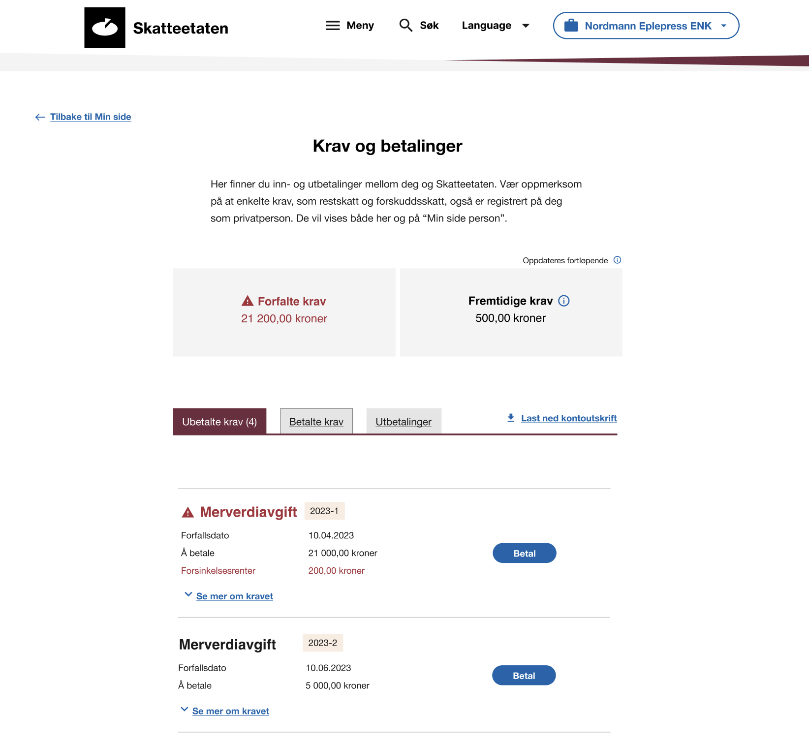
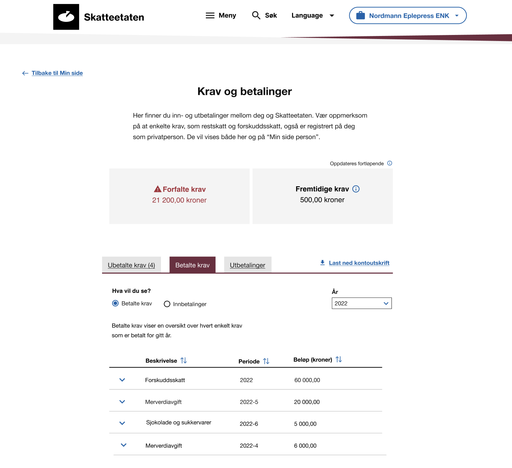
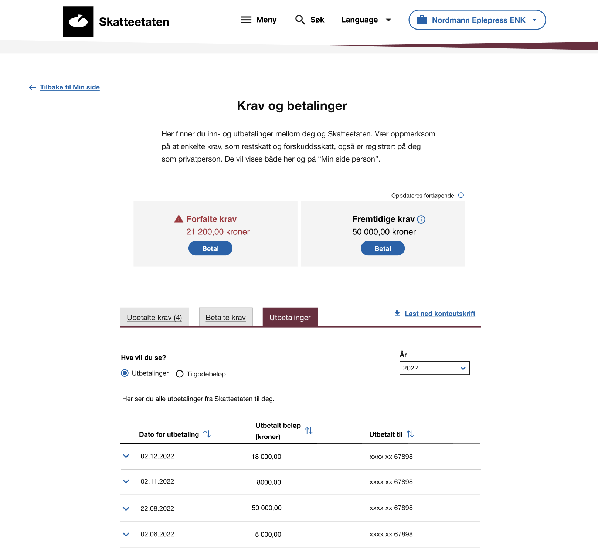
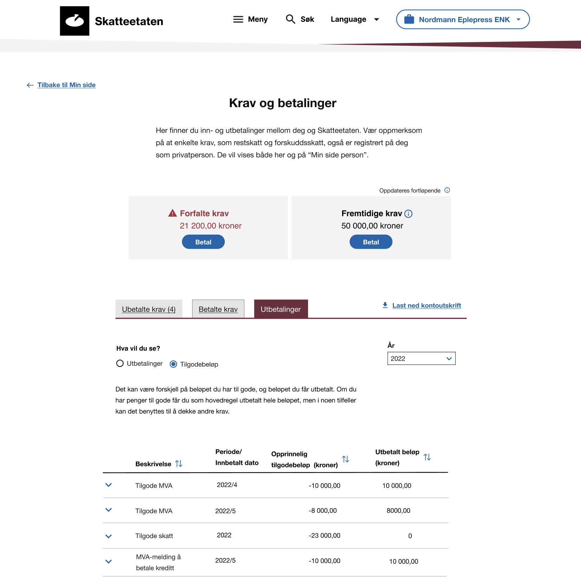

# Skisser

Tjenesten for **krav og betalinger** vil også bli tilgjengelig for brukerne på Skatteetatens egne digitale flater, i tillegg til det som leverandørene tilbyr i sine egne systemer. For å bidra til en grad av gjenkjennbarhet for brukeren på tvers av flatene, så vil vi her dele skisser for hvordan tjenestene vil se ut for brukeren se ut for brukeren på Skatteetaten.no.

Løsningene er under brukertesting og det kan fremkomme endringer, og vil vil også gjerne ha dialog med leverandørene og dele vår innsikt og våre erfaringer fra brukertester for at vi sammen kan lage best mulig tjeneste for brukerne.

## Skisser

### Ubetalte krav

### Betalte krav

### Innbetalinger

### Utbetalinger

### Tilgodebeløp

### Betalingsinfo

