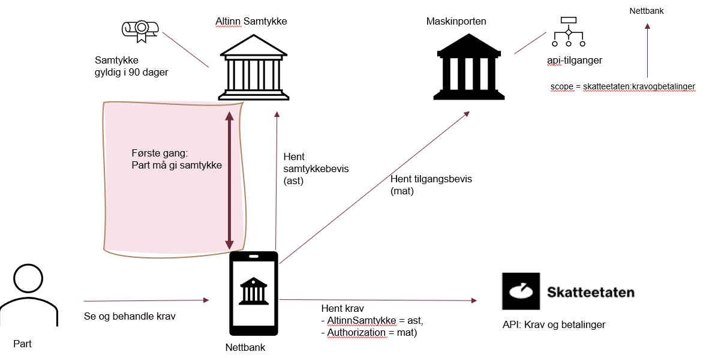

# Tilgang til tjenesten

For å få tilgang til tjenesten må leverandøren ha underskrevet en pilotavtale med Skatteetaten.
Tilgangsmekanismen vil være en kombinasjon av Altinn Samtykke og [Maskinporten](https://skatteetaten.github.io/datasamarbeid-api-dokumentasjon/about_maskinporten.html).

Parten kan, hvis regnskapssystemet og/eller mobil- og nettbank har implementert støtte for det velge om den ønsker å se egne krav. 
Parten vil bli rutet til en godkjenningsdialog i Altinn Samtykke. Når skyldner har akseptert godkjenningsdialogen, 
vil finansforetaket/systemleverandøren kunne hente et autentiseringstoken (samtykkebevis) fra Altinn Samtykke som bekrefter aksepten, 
APIet, identiteten til skyldner og identiteten til finansforetaket/systemleverandøren.

For å gjøre kall mot Skatteetatens API for krav og betalinger må finansforetaket/systemleverandøren  hente et autoriseringstoken 
(tilgangsbevis) fra Maskinporten. Begge disse bevisene må legges ved i kall mot APIet. Skatteetaten vil validere bevisene og vil returnere 
data hvis disse er gyldige (har de riktige signaturene).

I påfølgende kall mot APIet må samtykkebeviset og tilgangsbeviset fornyes da disse har kort levetid, typisk 20 – 60 sekunder.

1) Parten logger seg på *Nettbanken* og ber om å få tilgang til sine krav og betalinger (knapp/lenke)

2) Hvis det ikke foreligger noe gyldig samtikke (går ut etter 90 dager) så må *Nettbanken* gjør en redirect til 
Altinn for en gitt samtykkekode (authorizationCode) og be parten samtykke på nytt.
Bruker må identifisere seg via idporten, velger part og bekrefte samtykket med varighet 90 dager. 
Samtykket lagres i Altinn Samtykke. Samtykkeavtalen med gitt AuthorizationCode er satt opp av SKE i Altinn Samtykke.

3) *Nettbanken* ber Altinn om et access token for parten på samme authorizationCode og får tilbake et signert access-token (samtykkebevis). 
Eller en feil hvis det ikke finnes samtykke for denne parten.

4) *Nettbanken* ber Maskinporten om et access token (tilgangsbevis) for apiet, som er identifisert med scope:skatteetaten:kravogbetalinger. 
Dette forvaltes av SKE, og SKE må på forhånd ha gitt *Nettbanken* tilgang til scopet for apiet.

5) *Nettbanken* gjør så et kall mot kravogbetalinger api-et og legger med samtykkebeviset i headeren **AltinSamtykke** og tilgangsbeviset i headeren **Authorization**. 
Skatteetaten validerer signaturer og innsynsbeviset og leverer partens data (orgnr)

Finansforetaket og systemleverandøren er ansvarlig for at kun kunden (parten), eller person som har myndighet til å opptre på
vegne av denne, får tilgang til kravoversikten i regnskapssystemet eller mobil- og nettbanken. 
Det vil med andre ord være finansforetaket og systemleverandørens påloggingssystemer som avgjør hvem som 
har tilgang til å se oversikten i regnskapssystemet/mobil- og nettbanken.

Innsynet vil gjelde i 90 dager fra godkjenningsdato. Finansforetaket og systemleverandøren kan gjøre flere kall
på vegne av skyldner i denne perioden for å hente oppdaterte krav. Parten kan velge å trekke godkjenningen via
Altinn Samtykke. Skatteetaten kan velge å trekke tilgangen til finansforetaket eller systemleverandøren via Maskinporten. 