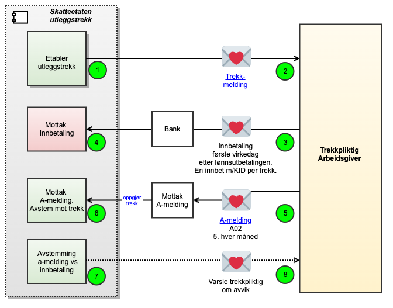

# Dokumentasjon for Utleggstrekk

# Felter
 - [ExtendedProblemDetail](./Models/ExtendedProblemDetail.md)
 - [Meldingstype](./Models/Meldingstype.md)
 - [MidlertidigStans](./Models/MidlertidigStans.md)
 - [Trekkbeloep](./Models/TrekkBeloep.md)
 - [Trekkmelding](./Models/Trekkmelding.md)
 - [TrekkProsent](./Models/TrekkProsent.md)
 - [UtleggstrekkFeedElement](./Models/UtleggstrekkFeedElement.md)
 - [PatchRequest](./Models/PatchRequest.md)

# Oppfølging og støtte
I testfasen vil vi tilby støtte til de eksterne leverandørene gjennom utvikling og test. Mer informasjon kommer her etterhvert.
I mellomtiden – ta kontakt med fremtidensinnkreving@skatteetaten.no.

# Grensesnitt for å innbetale og rapportere utleggstrekk
I tillegg til å trekke arbeidstakere i lønn skal også arbeidsgivere innbetale det som er trukket i lønn til skatteetaten, samt rapportere dette i A-meldingen.
Skatteetaten på sin side vil kontrollere at alle dataene er korrekte.

Figuren viser alle grensesnittene:

