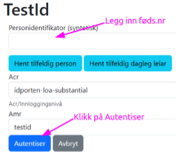
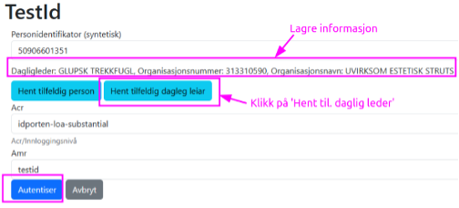

# Testing

## Krav til testgjennomføring

Systemleverandørene har ansvar for egen testgjennomføring. Det må fokuseres på at det kan hentes meldinger via gitt endepunkt beskrevet av skatteetaten. Se https://skatteetaten.github.io/beta-apier/trekkpaalegg/apispesifikasjon

Prosjektet bistår med feilsøk og evt. feilretting av vår løsning.

## Oppsummering av test og oppstart i produksjon

Systemleverandørene skal etter avsluttet testperiode og i forkant av produksjon oppsummere testen. Oppsummeringen skal vise hva som er testet, samt status etter gjennomført test inkludert oversikt over feil og mangler. Systemleverandørene skal på skatteetatens forespørsel fremlegge dokumentasjon på hvordan integrasjon er testet.

## Testmiljø

Systemleverandørene må ha testmiljøer som kun består av syntetiske data. Lenke til Skatt sitt testmiljø er 
http://trekkformidling-ikutlegg-ekstern-deling.apps.utv10.paas.skead.no/swagger-ui/index.html

Testmiljøet til Skatteetaten vil i utgangspunktet være tilgjengelig 24/7, men det kan ikke forventes teknisk support eller restart av miljøet hvis det går ned utenfor ordinær arbeidstid (kl. 8 – 15 alle ukedager). Miljøet kan være nede på kveldstid og i helger på grunn av vedlikehold. Testmiljøet til Altinn er [TT02](http://tt02.altinn.no).

## Testdata

For å teste trenger systemleverandør en testbruker som er daglig leder i en tilknyttet enhet.

|   | Testbehov        | Beskrivelse                                                                                                                                                                                                                                                                              | Kommentar                                                                             |
|---|------------------|------------------------------------------------------------------------------------------------------------------------------------------------------------------------------------------------------------------------------------------------------------------------------------------|---------------------------------------------------------------------------------------|
| 1 | Hvis du allerede har en testbruker du ønsker å bruke | <ul><li>Følg lenke til testmiljøet til Altinn</li><li>Velg ‘Log inn i Altinn (TT02) testmiljø’</li><li>Velg ‘TestID’</li><li>Legg inn fødselsnummer til daglig leder</li><li>Klikk på ‘Autentiser’</li><li>Under ‘Alle dine aktører’ klikk på organisasjon som daglig leder representerer</li></ul>                    | Lenke til testmiljø i Altinn http://tt02.altinn.no      |
| 2 | Hvis du skal finne en ny testbruker | <ul><li>Følg lenke til testmiljøet til Altinn</li><li>Velg ‘Log inn i Altinn (TT02) testmiljø’</li><li>Velg ‘TestID’</li><li>Velg ‘Hent tilfeldig daglig leder’</li><li>Lagre personidentifikator og organisasjonsnummer</li><li>Klikk på ‘Autentiser’</li><li>Under ‘Alle dine aktører’ klikk på organisasjon som dagligleder representerer</li></ul>  | Lenke til testmiljø i Altinn http://tt02.altinn.no    |

## Oppsett av maskinport-integrasjon og eventuelt systembruker

Se [tilgang](./tilgang.md) for hvordan få tilgang til tjenesten.

Tilgang til scope i test bestilles ved å sende en mail med ditt organisasjonsnummer til fremtidensinnkreving@skatteetaten.no

## Verifisere at du når løsningen og be deretter om å få opprettet testdata for trekkpålegg

|   | Steg             | Beskrivelse                                                                                                                                                                                                                  | Kommentar |
|---|------------------|------------------------------------------------------------------------------------------------------------------------------------------------------------------------------------------------------------------------------|-------|
| 1 | Gjør et kall mot tjenesten for trekkpålegg for å verifisere at du når tjenesten i test | Se lenke under seksjon Testmiljø over. Før det er tilgjengeliggjort data for dere, så vil du få en respons 200.                                                                                                              |       |
| 2 | Få tilgang på testdata | Når integrasjonen er testet tar du kontakt med oss via mail fremtidensinnkreving@skatteetaten.no og oppgir det org.nummeret dere har klargjort. Vi vil legge tilgjengelig testdata til dere for dette organisasjonsnummeret. | Dere vil kunne få testdata på flere parter på samme org.nummer eller dere oppretter flere org.nummer som dere ønsker å hente fra.      |

## Testplan

|        | Oppstart         | Innhold                        |
|--------|------------------|--------------------------------|
|        | 1. november 2024 | Hente meldinger om trekkpålegg |
