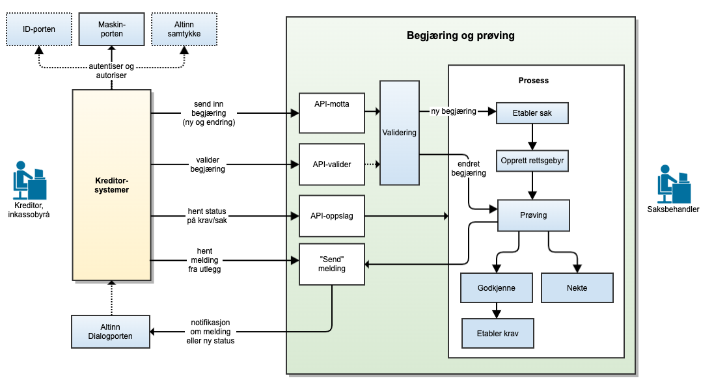

# Utleggsbegjæring og prøving

## Om tjenesten

Utleggsbegjæring er en tjeneste for å sende utleggsbegjæringer til namsmannen gjennom Skatteetatens systemløsninger.

Målgruppen er dagens inkassosystemer, kommunene og andre systemleverandører.

Dersom du ønsker å ta i bruk **utleggsbegjæring og prøving** i ditt system eller har spørsmål knyttet til dette, ta kontakt med fremtidensinnkreving@skatteetaten.no.

## Arkitekturskisse
Figuren nedenfor angir overordnet tjenester Skatteetaten vil tilby for mottak og prøving av utleggsbegjæringer. Merk at figuren er en illustrasjon av måbildet, og det er ikke alle tjenestene i figuren som er implementert ennå. Det vil også i fremtiden kunne legges til nye tjenester som ikke er angitt i figuren.

## Altinn Dialogporten
Når det gjelder [Altinn Dialogporten](https://docs.altinn.studio/dialogporten/), er bruk av denne ikke en del av Piloten våren 2025. Videre er leverandører hverken i Pilot eller i full produksjon påkrevet å å integrere med Dialogporten. Det vil være tilstrekkelig å kun benytte API-endepunktene. Gjennom Dialogporten vil vi imidlertid tilby en tjeneste for hendelsesvarsler ([events](https://docs.altinn.studio/dialogporten/getting-started/events/)) som angir når det er kommet nye meldinger fra Skatteeetaten, eksempelvis at det er bedt om retting av en tidligere innsendt utleggsbegjæring. Dersom man velger å ikke bruke varslingstjenesten, må man se etter nye meldinger ved jevnlig å gjøre spørringer mot etatens API (polling).

## Oppfølging og støtte

I testfasen vil vi tilby støtte til de eksterne leverandørene gjennom utvikling og test.

Mer informasjon kommer her.

I mellomtiden – ta kontakt med fremtidensinnkreving@skatteetaten.no.