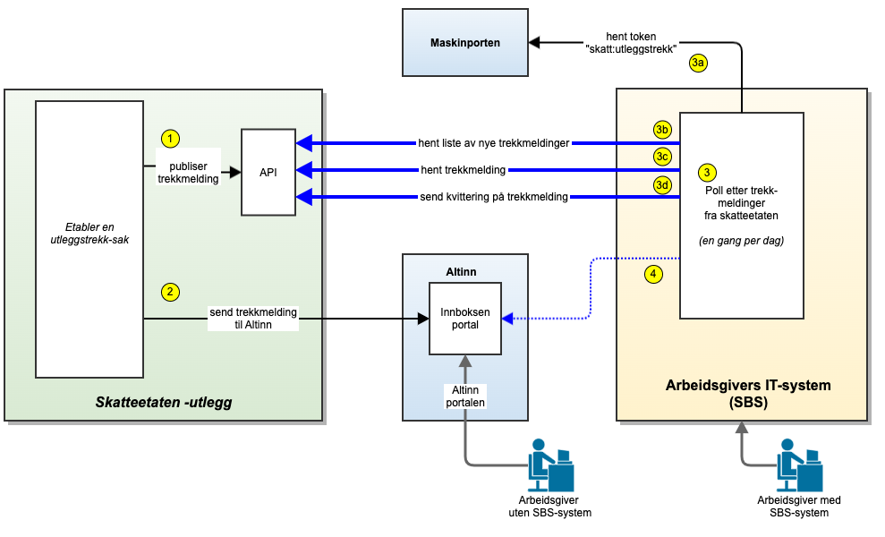

# Skisser

Figuren under viser arkitekturen:

## Beskrivelse:

1. Skatteetaten etablerer en ny utleggstrekksak og publiserer en JSON-melding om dette i utleggstrekk-API
2. En melding om utleggstrekk (PDF) sendes også til arbeidsgivers innboks i Altinn slik at arbeidsgivere uten SBS kan
   motta meldingen.
3. SBS poller mot nye utleggstrekk fra Skatteetaten en gang per dag.
    - a. SBS henter et token fra Maskinporten
    - b. SBS utfører kall (get) mot utleggstrekk-API for å hente nye trekk-id´er
    - c. SBS utfører kall (get) mot utleggstrekk-API for å hente utleggstrekk
    - d. SBS oppretter en trekksak i SBS og kvitterer dette ut med et kall (post) til utleggstrekk-API
3. SBS kan også hente det samme utleggstrekket fra Altinn-innboksen. Det anbefales å gjøre dette i tillegg til
   API-grensesnittet i starten for å oppnå robusthet mot feil.